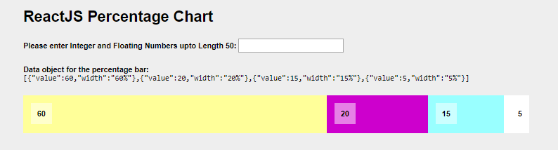

<h1>React.js Percentage Chart</h1>

  

<b>Steps to run</b>
1. npm install - to install the node packages
2. npm run build - to build the bundle.js
3. npm run start - to start the server 

To access the app
http://localhost:8080/chart/
